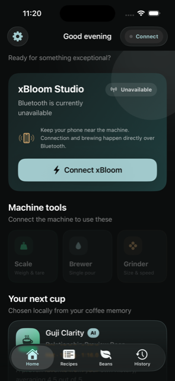
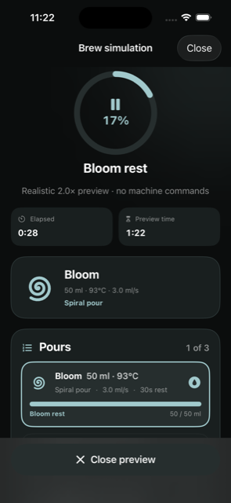
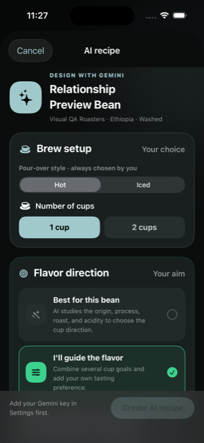
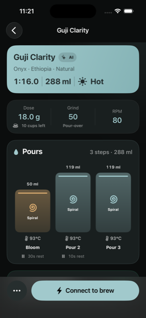
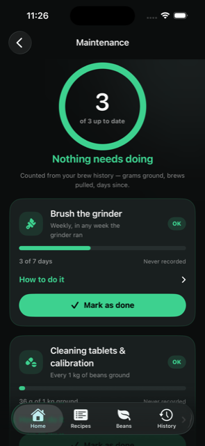
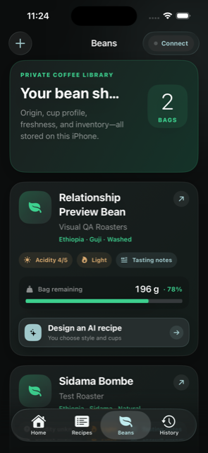
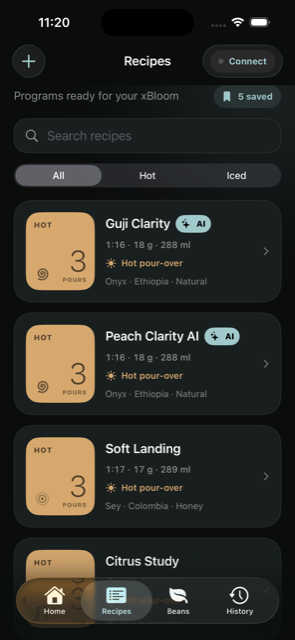
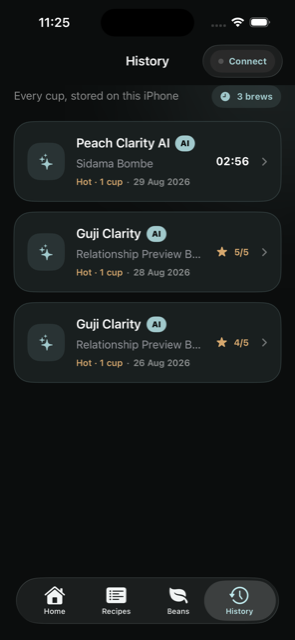

# xBloom Native

**An iPhone companion for the xBloom Studio** — reverse-engineered from
recordings of a real machine, built for the parts of brewing the official app
leaves out.

It knows what is in the hopper, what the last cup tasted like, what the machine
is about to do, and when it last had something done to it. Your library lives on
your phone; it syncs to *your* Supabase project, and AI requests go through an
authenticated Edge Function, so no provider key is ever shipped in the app.

<p align="center">
  
  
  
</p>

<p align="center">
  <em>Swift 6 · SwiftUI · SwiftData · Core Bluetooth · Supabase · Gemini · 62 tests</em>
</p>

> **Unofficial.** Not affiliated with or endorsed by xBloom. The protocol was
> recovered from Bluetooth recordings of one machine and from the MIT-licensed
> [PyBloom](https://github.com/fhenwood/PyBloom) project. It can move
> mechanisms, run the grinder, and dispense near-boiling water. Test attended.

**[Installation guide →](INSTALLATION.md)**

---

## What it does that the official app does not



### It weighs the dose before it commits to it

The recipe's dose is a target. Coffee does not come out of a bag in exact
grams, so the app opens the machine's own scale first, holds the reading when
you lift the container off it, and lets you correct it by hand. That figure —
not the recipe's rounded target — is what the machine is told, what history
records, and what comes off your bean bag.

Weighing and loading are separate steps on purpose: the beans have to leave the
scale and go into the grinder in between, and the screen waits to see the scale
fall back to zero before it offers to start.

### It stops a brew that is about to pour over whole beans

A machine that takes the no-grind branch of a grinding recipe soaks your dose in
hot water and reports no error at all. The app arms an interlock the moment the
recipe is executed: if water starts before any gear movement, grinder event, or
grinding screen, it sends a stop at the first pour.

The earlier version of that guard stopped on a *screen change*, which cancelled
valid brews — a display is not proof a mechanism did or did not move. The one
that shipped waits for the machine's own watering event.

### It reads the machine honestly, or says nothing

Everything on the live brew screen came out of Bluetooth recordings of the real
machine:

- **Poured volume** is a float in microlitres. An earlier guess at the scale
  turned a 45 ml bloom into 450 ml and pinned the display at "finished" seconds
  into every brew.
- **Cup yield** is the lowest scale reading in a 1.6 s window, because the scale
  drops to 0.0 for single frames mid-pour and reads 3.4 kg if you lean on the
  machine.
- **Temperature** is not shown as a measurement, because this machine has never
  sent one — zero readings in 2,343 recorded frames. The recipe's target is
  labelled as a target.
- **The clock** starts when the machine reaches its brewing screen and stops
  while the recipe is paused, so it agrees with the display on the machine
  rather than drifting away from it by the length of the grind.

### It shows the burrs travelling

Ask the grinder for a new size and the machine spends up to six seconds walking
the burr carrier there before it grinds anything. The gear stream turns out to
be the dial itself, offset by thirty — so the grind-size control carries a grey
bar at the burrs' real position, stepping toward your setting as the machine
moves, and the elapsed timer starts when grinding actually begins.

<br clear="right" />



### It says when the machine next needs something done to it

A maintenance screen counts three services out of your brew history rather than
asking you to log anything:

| Service | Falls due |
|---|---|
| Brush the grinder | Weekly, but only in a week the grinder actually ran |
| Cleaning tablets & calibration | Every 1 kg of beans ground |
| Descale | 300 brews or three months |

Each carries xBloom's own published procedure — grind size 55 for the tablets,
250–300 ml of water with 80–90 ml of descaling solution, their warning about
vinegar voiding the warranty. Every service you record is a row, so the app can
tell you how often you *actually* descale, not only when you last did.

### Direct machine tools

Scale, single pour, and grinder, each on its own screen. Every control waits for
the machine to echo the command back and says so plainly when it does not —
several of these payload shapes have never been confirmed, and a control that
pretends to have worked is worse than one that admits it did not.

The single-pour screen deliberately does *not* use the vendor's direct brewer
opcodes. They would open a valve on near-boiling water with a payload nobody has
verified; a one-step recipe carries the same four settings down a path the
machine has demonstrably understood.

<br clear="right" />

---

## What the AI does

Requests run through a Supabase Edge Function against Gemini. Three things use
it, and all three now run in the background — start one, leave the screen, and
the library shows it working.

### Reads a coffee bag from photos

Photograph the front and back labels. The bag lands on your shelf as soon as it
is read, flagged **NEEDS REVIEW**: origin, producer, variety, process, altitude,
roast level and tasting notes, all filled in from the label, with a card at the
top of the bean saying a machine wrote it and asking you to confirm. A record
nobody has checked says so until somebody checks it.

### Designs a recipe

Not a template with the numbers swapped. The brief tells the model there is no
universally correct pour count and to derive the whole architecture — pours,
bloom, grind, temperature, flow, agitation, ratio — from roast development,
process, density, origin and the cup you asked for. A washed high-elevation
Ethiopian and a natural Brazilian should not come back with the same shape, and
they do not.

You choose hot or iced, one or two cups, and either "best for this bean" or a
set of flavour goals that combine (Bright ↔ Low acidity replace each other;
Sweetness and Body do not). Pours are the model's decision by default, with an
override for when the answer is simply three. A bean from your shelf is
optional — without one you describe the coffee in a sentence, and if you leave
even that blank the recipe comes back designed for a typical washed
medium-light filter coffee and says so in its own rationale.

### Improves a recipe from what actually happened

Rate a brew and the model sees the recipe, the bean, and the real extraction —
duration, machine water, scale yield, completed pours — alongside your rating
and notes, and proposes the next version.

Every recipe it returns goes through the same machine-safety validation a
hand-written one does: dose 5–30 g, grind 1–80, 1–8 pours, ≤ 500 ml, 80–96 °C,
3.0–3.5 ml/s. The AI cannot talk the machine into anything the editor could not.

---

## The rest of it

<p align="center">
  
  
  
</p>

- **Beans** — origin, process, roast date, acidity, tasting notes, bag weight
  drawn down by every brew, and refills that keep a bag's recipes and history
  connected.
- **Recipes** — a full editor over the machine's real parameter space, with
  validation that explains itself, plus import/export of a whole library.
- **History** — every brew with its telemetry curve, rated and tagged, feeding
  both the AI and the maintenance counters. The newest twenty are kept; a bag
  rarely outlives twenty cups.
- **Live Activity** — the brew on the Lock Screen and Dynamic Island.
- **A preview mode** — watch a recipe run end to end at realistic speed with no
  machine connected and no commands sent.
- **Machine diagnostics** — record the Bluetooth session and share the
  transcript. Every protocol finding in `docs/` came out of one of these.

Deleting means what it says: a bean takes its recipes and their brews, a recipe
takes the brews that ran it and leaves the bean, and the deletions reach your
account rather than lingering there.

---

## Getting started

Full instructions, including standing up your own Supabase project, are in
**[INSTALLATION.md](INSTALLATION.md)**. The short version:

```sh
git clone https://github.com/Lui35/Enahnced-Xbloom-IOS-App.git
cd Enahnced-Xbloom-IOS-App
cp Secrets.example.xcconfig Secrets.xcconfig
xcodegen generate && open XBloom.xcodeproj
```

Set your own signing team and bundle identifier, and run it on an iPhone — the
simulator has no Bluetooth. The app is fully usable with no account at all;
sync and AI need a Supabase project of your own, which the guide walks through.

## Tests

The domain and protocol logic lives in `Sources/XBloomCore` and runs without
Xcode:

```sh
swift test
```

Those tests are written against the recordings: the verified recipe encoding,
the microlitre volume counter, the yield curve with its dropouts and its hand
on the scale, the brew clock, the grinder interlock, and the maintenance rules.

## Contributing

The protocol work is the interesting part, and it advances one recording at a
time. If you own an xBloom:

- **Record a session** in Settings → Machine diagnostics and share the
  transcript. A capture from different firmware, or of a brew this app has
  never seen — a tea recipe, an Easy Mode program, a fault — is worth more than
  any amount of guessing.
- **`docs/VERIFIED_MACHINE_BEHAVIOUR.md` is the rule**: a claim about the
  machine belongs there only once a recording shows it. Findings are numbered,
  and each says what was observed versus what was inferred.
- Domain and protocol logic lives in `Sources/XBloomCore` and is testable
  without Xcode. New behaviour comes with a test written against a real
  recording where one exists.

Open questions are listed under **Still unverified** at the end of the verified
behaviour document.

### How a change reaches main

`main` is protected: no direct pushes, from anybody, including the owner.

```sh
git checkout -b your-branch
# work, commit
git push -u origin your-branch
gh pr create
```

Two checks run on every pull request and both must be green before the merge
button unlocks:

| Check | What it runs |
|---|---|
| **Tests** | `swift test` — the XBloomCore suite, no project or simulator needed |
| **Build** | `xcodegen generate` then a full app build for the iOS Simulator |

The branch must also be up to date with `main`, review conversations must be
resolved, and force-pushing or deleting `main` is refused outright.

## Documentation

- `docs/APP_BLE_IMPLEMENTATION.md` — what this app sends: the brew sequence with
  and without the grinder, the pre-brew scale, weighing and grinder screens, the
  grinder interlock, and how a dose comes off the bean bag.
- `docs/VERIFIED_MACHINE_BEHAVIOUR.md` — what the owner's machine actually does,
  read out of traffic recordings. Takes precedence over everything else.
- `docs/OFFICIAL_APP_BLE_COMPARISON.md` — the vendor's command table, extracted
  from its shipped binary.
- `docs/PYBLOOM_BLUETOOTH_API.md` — the third-party reference this app started
  from. Describes different firmware in places; treat as background.

The Bluetooth implementation is unofficial, derived from the MIT-licensed
PyBloom interoperability project and from recordings of one machine. It is not a
vendor-supported API and can change without notice. See `THIRD_PARTY_NOTICES.md`.
